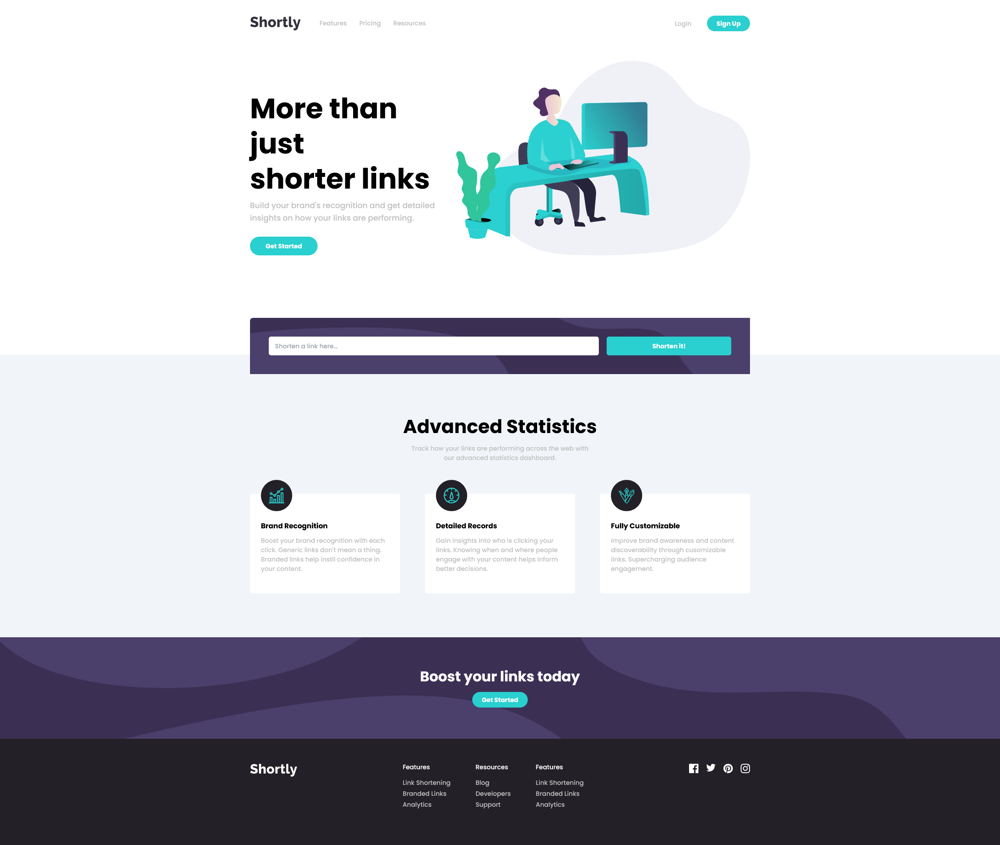

# Frontend Mentor - Shortly URL shortening API Challenge solution

This is a solution to the [Shortly URL shortening API Challenge challenge on Frontend Mentor](https://www.frontendmentor.io/challenges/url-shortening-api-landing-page-2ce3ob-G). Frontend Mentor challenges help you improve your coding skills by building realistic projects.

## Table of contents

- [Overview](#overview)
  - [The challenge](#the-challenge)
  - [Screenshot](#screenshot)
  - [Links](#links)
- [My process](#my-process)
  - [Built with](#built-with)
  - [What I learned](#what-i-learned)

## Overview

### The challenge

Users should be able to:

- View the optimal layout for the site depending on their device's screen size
- Shorten any valid URL (Not working)
- See a list of their shortened links, even after refreshing the browser (url shortening features not available)
- Copy the shortened link to their clipboard in a single click
- Receive an error message when the `form` is submitted if:
  - The `input` field is empty

### Screenshot

### Links

- Solution URL: [Here](https://www.frontendmentor.io/solutions/responsive-url-shortening-website-B6MOkkTEur)
- Live Site URL: [Here](https://url-shortener-six-tawny.vercel.app/)

## My process

### Built with

- Semantic HTML5 markup
- Flexbox
- [React](https://react.dev/) - JS library
- [Next.js](https://nextjs.org/) - React framework

### What I learned

This was my first ever project using next.js and I learned lots of things about it. I also got good practice with my React and Tailwind skills.
